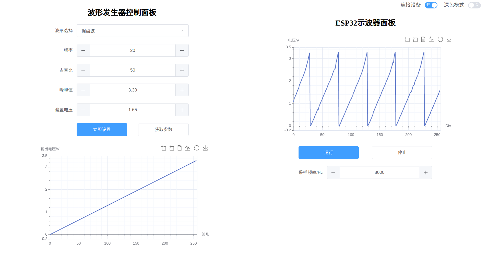

<!--
 * @文件路径         : \ESP32WebScope\README.md
 * @作者名称         : guohaomeng
 * @文件版本         : V1.0.0
 * @创建日期         : 2022-07-13 22:26:15
 * @简要说明         : 
 * 
 * 版权信息         : 2022 by guohaomeng, All Rights Reserved.
-->
# ESP32WebScope

只用一块ESP32制作的ESP32网页示波器+波形发生器,可以拿来生成以及观察低频信号，仅做学习使用

### 特性

波形发生器部分采用硬件定时器中断进行DAC输出的方式，运行在核心1上。实现方法可见`wave_gen.hpp`文件，里面注释很详细。

- 波形发生器频率 0-1500Hz
- 波形种类：正弦波、方波、锯齿波
- 可设置偏置电压与峰峰值
- 默认输出引脚 DAC channel 1 即 GPIO25(ESP32)

示波器部分是通过i2s进行adc采样后发送给上位机显示的，同样也运行在核心1上。每轮采样1024个点，但只取其中256个，取样间隔可通过设置全局变量`sampleStep`来改变。

- 示波器采样率，即I2S采样速率，我在代码里限制为1k~128K
- 默认采样引脚是ADC1_CHANNEL_7，即GPIO36
- 示波器更多功能有待继续添加

通信方面，ESP32在`websocket_init`函数中初始化了一个websocket服务器以及一个http服务器。与通信相关的程序主要运行在核心0上。

这里要感谢来自Vida Wang大佬的[websocket库](https://github.com/vidalouiswang/Arduino_ESP32_Websocket)

http服务器主要提供静态网页托管功能，可以将存放在flash中的web资源发送给客户端，发送完一次静态资源(280kb)大概需要3~5秒。

websocket服务器主要用于同客户端建立websocket连接并进行双向通信，客户端通过web界面向ESP32发送指令以更改参数，ESP32则可以主动向客户端发送采样数据及其他信息

web界面如下所示，其源代码见我的另一个仓库`ESP32WebScopeUI`

### 使用方法

1. 首先克隆本仓库到自己硬盘上，然后用vscode的`platformIO IDE`插件打开

2. 然后需要编译并上传data目录下的web资源文件，点击侧边栏的PIO蚂蚁图标，在esp32dev下拉菜单中找到Platform并展开，点击`Build Filesystem Image`根据data目录生成镜像文件，然后连接开发板点击`Upload Filesystem Image`上传到ESP32中。

3. 之后便是正常编译下载程序，这个我相信大家肯定都会^_^
